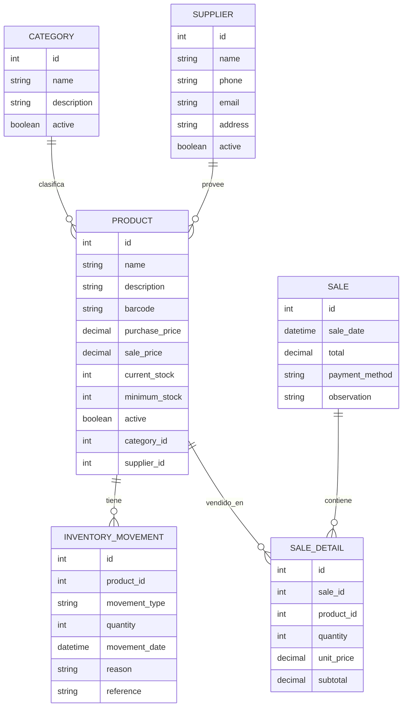

# StockGuard PyME - Modelo Entidad-Relación

## 1. Objetivo

El objetivo de este documento es representar las principales entidades del sistema y las relaciones entre ellas.

El modelo entidad-relación permite entender cómo se conectan los datos antes de crear la base de datos en SQL.

## 2. Entidades del sistema

Las entidades iniciales del sistema son:

- Categoría
- Proveedor
- Producto
- Venta
- Detalle de venta
- Movimiento de inventario

## 3. Relaciones principales

### Categoría y Producto

Una categoría puede tener muchos productos.

Un producto pertenece a una categoría.

Ejemplo:

- Categoría: Bebidas
- Productos: Coca-Cola 1.5L, Fanta 1.5L, Agua mineral

### Proveedor y Producto

Un proveedor puede entregar muchos productos.

Un producto puede tener un proveedor principal.

Ejemplo:

- Proveedor: Distribuidora San Javier
- Productos: bebidas, abarrotes, artículos de aseo

### Venta y Detalle de venta

Una venta puede tener uno o varios productos asociados.

Cada producto vendido dentro de una venta se registra como un detalle de venta.

Ejemplo:

Venta N°1:

- Coca-Cola 1.5L x 2
- Pan de molde x 1
- Pilas AA x 1

### Producto y Movimiento de inventario

Un producto puede tener muchos movimientos de inventario.

Cada movimiento representa una entrada, venta, ajuste o merma.

Ejemplo:

Producto: Coca-Cola 1.5L

- Entrada: +20 unidades
- Venta: -2 unidades
- Ajuste negativo: -1 unidad

## 4. Diagrama inicial

## 5. Explicación del diagrama

- `CATEGORY` representa las categorías de productos.
- `SUPPLIER` representa los proveedores.
- `PRODUCT` representa los productos del negocio.
- `SALE` representa una venta.
- `SALE_DETAIL` representa los productos vendidos dentro de una venta.
- `INVENTORY_MOVEMENT` representa los cambios en el stock.

## 6. Reglas importantes

- Un producto debe pertenecer a una categoría.
- Un producto puede tener un proveedor principal.
- Una venta debe tener al menos un detalle de venta.
- El stock de un producto no puede quedar en negativo.
- Cada cambio de stock debe registrarse como movimiento de inventario.